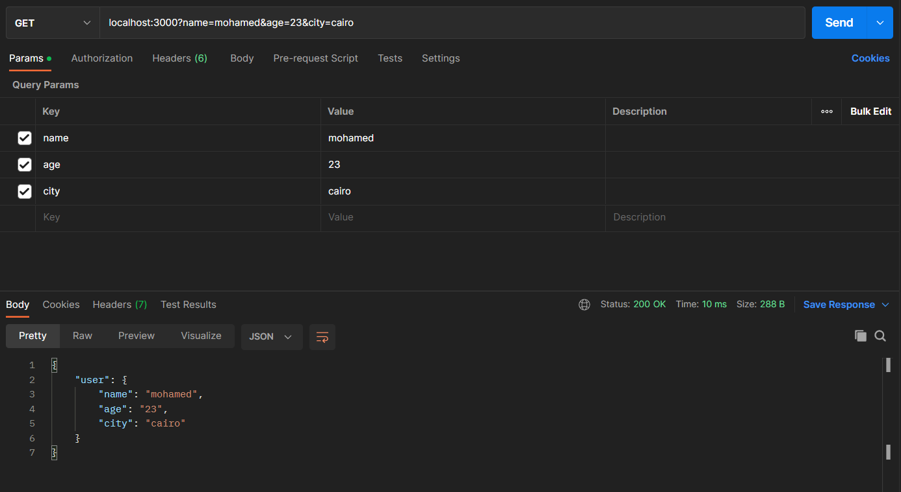

### Node.js application that has a bug, and I would like you to debug and fix it. Please explain your approach to debugging and how you would troubleshoot and fix the issue.

```Javascript
const express = require('express');
const app = express();
app.get('/', (req, res) => {
 const name = req.query.name;
 const age = req.query.age;
 const city = req.query.city;
 if (!name || !age || !city) {
 res.status(400).json({ error: 'Incomplete data' });
 }
 const user = { name, age, city };
 res.json({ user });
});
app.listen(3000, () => {
 console.log('Server is running on port 3000');
});
```

<mark>Answer:</mark>

<p>The “[ERR_HTTP_HEADERS_SENT]:  Can't set headers after they are sent to the client” occurs when an express.js application tries to send multiple responses for a single request.</p>

<p>We have to be careful to send only one response for a single request from the node server. The commonly used functions that send responses are res.redirect(), res.render(), res.send() and res.json().</p>


